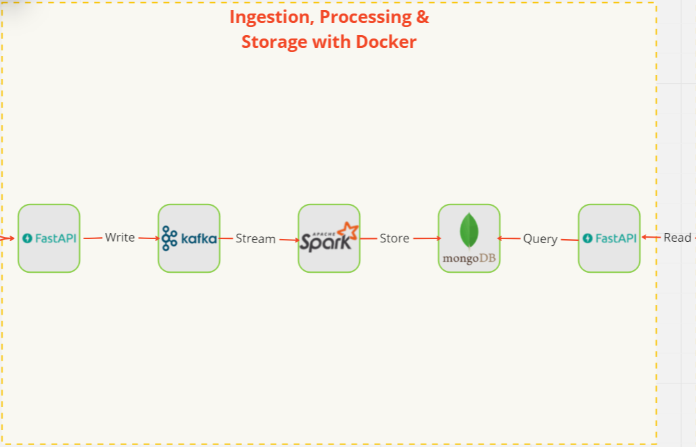
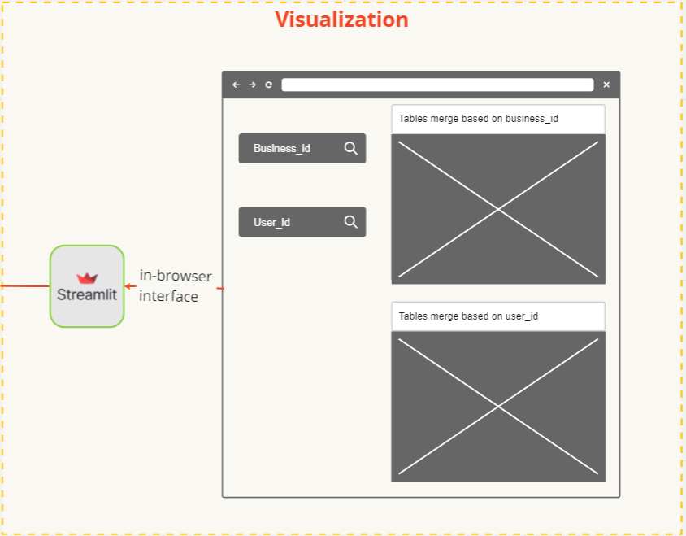
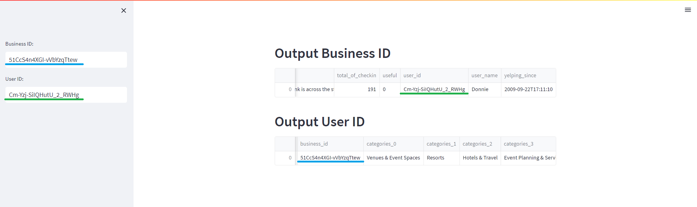

# Yelp Document Streaming: A Data Pipeline Project

# Introduction & Goals

>>This project will show how to stream, process, and visualize JSON documents from the Yelp dataset using various tools 
and technologies. We can see how the Yelp data can be integrated and enriched by merging the data coming from different 
files into a single database. This way, we can avoid the complexity and inefficiency of doing a JSON merge on voluminous
files, which can be very difficult and time-consuming

# Contents

- [The Data Set](#the-data-set)
- [Used Tools](#used-tools)
  - [Connect](#connect)
  - [Buffer](#buffer)
  - [Processing](#processing)
  - [Storage](#storage)
  - [Connect to Storage](#connect-to-storage)
  - [Visualization](#visualization)
- [Setup](#setup)
- [Pipelines](#pipelines)
  - [Data Preprocessing](#data-preprocessing)
  - [Data Stream](#data-stream)
  - [Processing Data Stream](#processing-data-stream)
  - [Visualizations](#visualizations)
- [Demo](#demo)
- [Conclusion](#conclusion)
- [Follow Me On](#follow-me-on)
- [Appendix](#appendix)


# The Data Set
- The dataset is a subset of Yelp’s businesses, reviews, user, checkin and tip data that can be used for various 
research projects
- Data Source : https://www.yelp.com/dataset/download 
- Documentation of Yelp dataset : https://www.yelp.com/dataset/documentation/main

This documentation explain the structure of business.json, review.json, user.json, checkin.json and tip.json

Here the content of a **business** document


The content of a **review** document


The content of a **user** document


The content of a **checkin** document


The content of a **tip** document


# Used Tools
## Connect
- FastAPI to validate the schema of JSON documents and send them to a Kafka producer
## Buffer
- Kafka producer to distributes the JSON documents to PySpark
## Processing
- PySpark to processes and stores the JSON documents in MongoDB database
## Storage
- MongoDB database that persists the JSON documents based on the keys (user_id or business_id)
## Connect to Storage
- FastAPI to retrieves data from MongoDB and sends it to a Streamlit application
## Visualization
- Streamlit application that visualizes the Yelp data

# Setup
Since we have all services dockerized, we need to follow these steps to properly configure all 
the images and then deploy the containers:
- Clone the git repository, create a 'dataset' directory and put all the Yelp datasets in there,
that way you don't need to change anything in the code
- As we have a GUI and two APIs, all built from python code, we need to build their docker images
first. To do this :
  1.  In the terminal, go to `API-Kafka-Ingest` directory  and type: `docker build -t api-kafka-ingest .`
  2.  In the terminal, go to `API-Streamlit-output` directory  and type: `docker build -t api-streamlit-output .`
  3.  In the terminal, go to `Streamlit` directory  and type: `docker build -t streamlit .`
- We are now ready to build containers from our docker-compose file, to do this go to the main project directory
and type: `docker-compose up -d`
- Finally, create the Kafka topics **Yelp-topic** and **spark-output** with **3 partitions** and a **replication 
factor of 1** and the **Kafka broker** runs on **localhost:9092**. To do this : 
  1.  In the terminal, type `docker ps` to see running container
  2.  Copy the name of the kafka container, in my case it was `yelp-kafka-1`
  3.  Type `docker exec -it yelp-kafka-1 bash`
  4.  Type `cd opt/bitnami/kafka/bin/`
  5.  We can create now Topics, to do that, type : 
```shell
./kafka-topics.sh --create --topic Yelp-topic --partitions 3 --replication-factor 1 --bootstrap-server localhost:9092
```
```shell
./kafka-topics.sh --create --topic spark-output --bootstrap-server localhost:9092
```

# Pipelines


The upcoming posts will consist of writing about:
+ Pre-processing and cleaning of data from the Yelp dataset
+ The flow of the streaming process which includes the ingestion of data through an API, 
the processing and storage of the data
+ Visualisation where we have an interface in the browser where the end user can use "business_id" or 
"user_id" to query the data to be used

## Data Preprocessing

In the original Yelp dataset:
+ business.json contains an "attributes" sub-document which contains a string representation of a JSON object. 
We will transform the string representation of a JSON object into a JSON object

The content of the commercial document before transformation :


The content of the commercial document after transformation :


+ checkin.json contains the "date" attribute in which is the whole list of check-in dates.
We assume that we do not need this list of check-in dates and will replace it with its length


+ user.json contains the attribute "friends" which contains the complete list of friends (in terms of IDs) of this user.
We assume that we do not need this list of friends and replace it with the number of friends he has

Detail of transforming : [Transforming](Client/Transforming.py)

## Data Stream


+ We created a json collection that can be imported into postman to test the schema and the data sent to the API. 

Detail of json collection : [IngestAPI-TEST](API-Kafka-Ingest/Postman/IngestAPI-Test.postman_collection.json)

+ We created an API client that reads the json files and sends them to the API line by line (document by document)

Detail of the API client : [API-client](Client/api-client.py)

## Processing Data Stream



+ We created a fastAPI to ingest data from the client API and send it to a Kafka producer

Detail of the FastAPI : [API-Kafka](API-Kafka-Ingest/app/main.py)

+ We create a python script in pyspark that consumes the data from the kafka producer. In the same script, 
we set up a connection to mongodb for reading and writing


+ In pyspark, we convert the time from a string to GMT, and we have renamed some of the column names because
in the original files, some columns have the same name with different content


+ The main objective of the processing is to retrieve the line (document) from Kafka and see if it matches the mongodb 
database using the key "business-id" or "user-id".
So, if the key matches, we will join the upcoming data with the mongodb database otherwise we will simply insert
this line in mongodb

Detail of the Pyspark script : [Pyspark](ApacheSpark/02-streaming-kafka-src-dst-mongodb.ipynb)

+ For security reasons, we created a FastAPI to get all the necessary data from mongodb

Detail of the FastAPI : [API-Streamlit](API-Streamlit-output/app/main_output.py)

## Visualizations



+ We have created a streamlit application that retrieves data from the FastAPI connected to mongodb and displays 
some columns in a table. We can find any information using "business-id" or "user-id"

Detail of the Streamlit application : [Streamlit](Streamlit/app/streamlitapp.py)

# Demo

+ Here is an example of what the final application will look like. We can get the same information by 
searching for "business-id" or "user-id" because the data is merged



# Conclusion
Overall, I found this to be a very interesting project to explore. The key here is to merge json files into a single
NoSQL database. I have done with this project using many services, from ingestion to visualization. We can improve 
this project by adding authentication for the API for more security, or we can choose to work with a data frame that 
is stored in OFF HEAP, in MEMORY ONLY or in MEMORY AND DISK instead of reading the data from mongodb. The challenge 
for me would be the documentation, it is quite difficult to document your project in the best way possible so that 
other people can easily find their way around. However, for me, this project is a kick-start to understand more deeply
how data engineering works

# Follow Me On
+ Github: [@AdnenMess](https://github.com/AdnenMess)
+ LinkedIn: [@messaoudi-adnen](https://www.linkedin.com/in/messaoudi-adnen-8a513815/)

# Appendix

[Markdown Cheat Sheet](https://github.com/adam-p/markdown-here/wiki/Markdown-Cheatsheet)
